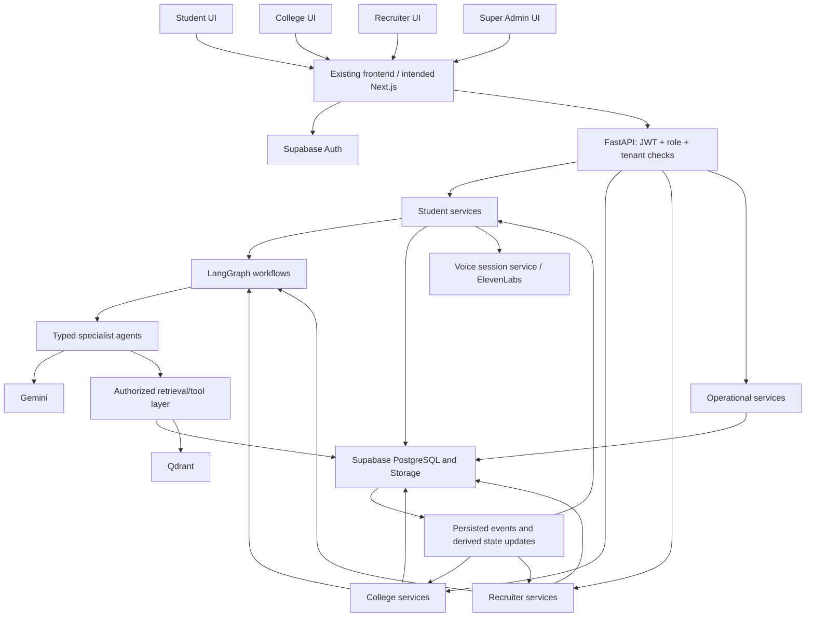

# CareerOS — Development Context

> Single-file handoff for Google Antigravity or another coding agent.
> Prepared: 2026-09-05.
> Source: full paginated text history of the ChatGPT conversation **Jdd**, ID **6a63a4d3-e7a8-83e8-b836-01a0dd257087**, including the user-supplied Complete System Flow Map and later product refinements.
> Scope: development and integration. This is not a pitch deck, a repository audit, or proof of production readiness.

## 0. Read this first

CareerOS is an **Agentic AI Career Operating System** connecting **students, colleges, and recruiters** through a shared career intelligence loop. The immediate engineering objective is to turn the existing Figma-exported frontend into a coherent, persisted, authenticated application whose screens consume real backend results.

**Do not rebuild the frontend from scratch.** The founder reported that the complete frontend was built in Figma and downloaded as code, then reported being stuck with sample frontend data and disconnected backend implementation.

Use the following evidence labels throughout this handoff:

- **Established context:** explicit user requirements, the user-supplied system map, or consistent product direction maintained through subsequent discussion.
- **Reported status:** implementation claims made in the conversation; not verified against a repository here.
- **Proposed implementation:** concrete defaults supplied by this handoff to fill gaps. Reconcile these with existing code before adopting them.
- **Unresolved:** the conversation did not settle the detail, or contains conflicting directions.

### First actions for the next coding agent

1. Locate the actual CareerOS repository and inspect its instructions, package manifests, routes, FastAPI routers, migrations, environment example files, and tests.
2. Run the existing app using its own documented setup. Record the actual framework and package versions; do not assume the Figma export already uses the intended stack.
3. Map each visible action to its API request, service/agent, database read/write, and resulting UI state.
4. Verify the backend status table in Section 11. Preserve working modules, especially ARIA.
5. Follow the implementation order in Section 12, completing each vertical flow through the actual UI.
6. Update this document's status with evidence after changes. A router, stub, screenshot, or generated response alone does not establish completion.

### Evidence limitations

All available conversation pages were retrieved through the oldest turn. The original discussion references a generated PRD, technical architecture, security/access document, frontend specification, and ticket list, but their complete standalone contents are not embedded in the retrieved history. An attachment named “Documents You Need Before Vibe Coding an App(1).pdf” and an image were listed; their contents are not incorporated here. Do not claim those documents or a repository were audited.

This handoff preserves the detailed user-pasted system map and reconciles later discussion. Field-level database schema, many response bodies, exact environment variable names, and operational thresholds were never finalized; those sections explicitly provide proposed implementation details.

## 1. Product vision, problem, and USP

### Vision

Guide a student from education to employment through personalized career planning, resume intelligence, a Digital Career Twin, skill-gap diagnosis, adaptive learning roadmaps, ARIA mentoring, ECHO interview practice, and relevant opportunities.

A student should be able to answer:

1. Where do I stand today?
2. What does my target career require?
3. What am I missing?
4. What should I do next?
5. How is my progress changing my readiness and opportunities?

### Problem statement

- Career preparation is fragmented across learning, mentoring, resumes, interview preparation, networking, and job portals.
- Generic guidance fails to account for individual skills, interests, goals, and progress.
- Students cannot clearly identify or prioritize skill gaps relative to a target role.
- Career decisions lack useful, current industry-demand context.
- Colleges have limited visibility into placement readiness and where intervention is needed.
- Recruiters spend too much effort screening resumes and assessing candidate fit.
- Student development, college placement operations, and recruiter feedback remain disconnected.

References to LinkedIn, Coursera, Udemy, LeetCode, Naukri, resume tools, and ChatGPT explain fragmentation. They do **not** imply that CareerOS already integrates those services or reproduces all their functionality.

### Final USP

**A closed-loop career intelligence ecosystem connecting students, colleges, and recruiters.**

- Students improve resumes, skills, learning progress, and interview performance.
- Colleges receive placement-readiness insights, department analytics, and intervention opportunities.
- Recruiters discover relevant candidates, review fit, and manage hiring.
- Hiring requirements, feedback, and outcomes improve subsequent student guidance and roadmap recommendations.

The final USP supersedes earlier suggestions that the primary differentiator is only a Digital Twin or multiple AI agents. Those remain flagship features supporting the ecosystem.

“Continuously learns” should initially mean **updates user state and recommendations from new evidence and feedback**. There is no finalized automatic model-training or fine-tuning pipeline. Do not implement one merely because pitch language uses that phrase.

Do not carry unsupported “world's first,” “only platform,” “guaranteed placement,” or “production ready” claims into product behavior or documentation.

## 2. Users, roles, and access boundaries

The established roles are **Student, Recruiter, College Admin, and Super Admin**, plus unauthenticated visitors.

| Role | Primary job | Access scope to implement |
|---|---|---|
| Visitor | Understand CareerOS and register/sign in | Public landing and authentication screens |
| Student | Build career readiness and find opportunities | Own profile, resumes, skills, chats, plans, interviews, applications, and recommendations |
| Recruiter | Find candidates and manage recruitment | Own organization, jobs, hiring pipeline, and explicitly discoverable/shared candidate information |
| College Admin | Monitor and improve placement outcomes | Students associated with the authorized college and approved institutional reports |
| Super Admin | Operate and monitor the platform | Explicitly privileged management and operational views, with auditable access |

**Established:** Supabase Auth, email login, Google OAuth, JWT validation, protected routes, session management, and role-based access.

**Proposed implementation rules:**

- Derive user identity from a verified session/token, never from a client-supplied user ID.
- Do not allow a signup role switcher to grant College Admin or Super Admin access directly.
- Store organization membership and role grants in server-controlled records.
- Enforce role and tenant checks in API services and PostgreSQL RLS. Frontend route protection is supplementary.
- Recruiter discovery requires an explicit visibility policy. Raw student chats and private learning notes are not automatically recruiter data.
- A “verified profile” label requires verification evidence and a defined verifier; parsing a resume does not verify its claims.
- Super Admin access is operationally separate from normal college/recruiter access.
- Define account deletion, resume deletion, organization removal, and vector cleanup together.

Organization membership cardinality, admin provisioning, candidate-sharing consent, and verification workflows remain unresolved product details.

## 3. Feature scope by module

Features below describe the intended product. See Section 11 for the historical implementation snapshot.

### Student intelligence

| Module | Intended capabilities | Required connected behavior |
|---|---|---|
| Dashboard | Career readiness, activity timeline/heatmap, goals, progress, placement-readiness indicators | Read persisted state and refresh after meaningful student actions |
| Career Twin | Digital career representation, target-role alignment, skill deficiencies, career trajectory, salary scenarios, readiness | Use profile, resume, skills, interview evidence, and learning progress |
| ARIA Mentor | Career Q&A, personalized guidance, goals, learning recommendations, contextual coaching | Retrieve the student's real career context and relevant knowledge |
| Resume Intelligence | PDF upload, parsing, ATS analysis, skill/experience extraction, keyword gaps, optimization suggestions | Persist analysis and feed skill state, Twin, roadmap, and matching |
| Skill Gap Intelligence | Current versus required skills, priorities, role readiness, diagnosis, recommended actions | Recalculate for selected role and link directly to a plan or ARIA |
| Learning Roadmap | Weekly plan, study pace, courses, projects, certifications, milestone progress | Persist plans and completion; update downstream career state |
| ECHO Interview | Technical/HR/behavioral practice, voice conversation, transcript, feedback and scoring | Persist sessions and use relevant interview evidence in future guidance |
| Jobs | Semantic job/internship recommendations, fit explanation, filters, application | Application appears in the appropriate recruiter pipeline |
| Profile | Personal data, education, experience, skills, achievements, resume management, settings | Act as shared structured input to all student modules |

Daily reminders, advanced forecasts, benchmarks, and live scoring appear in feature/prompt discussions but do not have complete delivery contracts. Do not silently treat them as working background services.

### College intelligence

- Placement readiness and student employability monitoring.
- Student roster, individual progress, resume completion, learning progress, and interview performance where access is permitted.
- Department/batch comparisons, skill-gap heatmaps, placement trends, and institutional reports.
- Identify students needing support, with explainable indicators.
- Recruiter engagement, campus hiring coordination, candidate sharing, and placement reporting.
- AI summaries should explain database-derived metrics; they must not invent aggregate counts.

### Recruiter intelligence

- Natural-language semantic candidate discovery.
- Skill, experience, readiness, and resume/job alignment.
- Candidate summaries and profiles with evidence provenance.
- Shortlists, applications, hiring stages, and pipeline analytics.
- Hiring outcomes and feedback that can feed the student-development loop.
- Job creation/management is necessary for a real hiring flow but its API was not specified in the source.

### Platform

Responsive interfaces, role-aware navigation, sessions, storage, notifications, chat persistence, real-time or refreshed analytics, monitoring, cloud deployment, and secure access are intended capabilities. A payment processor, notification provider, and billing implementation were not selected.

## 4. Pages and routes — preserve the established map

| Page | Route | Key UI elements | Main integration |
|---|---|---|---|
| Home | `/` | Hero, feature overview, CTA | Public navigation to auth |
| Auth | `/auth` | SignInForm, SignUpForm, RoleSwitcher | Supabase-backed auth and authorized role routing |
| Dashboard | `/dashboard` | ReadinessScore, ActivityHeatmap, UpcomingGoals | Dashboard analytics |
| Career Twin | `/career-twin` | TwinAvatar, ProjectionTimeline, MissingSkills | Generate and display Twin results |
| Mentor / ARIA | `/mentor` | ChatWindow, QuickActions, SuggestedPrompts | Contextual chat |
| Resume | `/resume` | UploadZone, ATSScoreDial, ImprovementList | PDF ingestion and analysis |
| Skills | `/skills` | SkillRadar, LearningPath, CertificationTracker | Gap analysis and roadmap |
| Interview / ECHO | `/interview` | VoiceVisualizer, QuestionCard, FeedbackPanel | Session creation and voice transport |
| Jobs | `/jobs` | JobFilters, MatchScoreCards, ApplyButton | Recommendations and applications |
| Profile | `/profile` | PersonalInfoForm, DangerZone, SignOutButton | Profile persistence and session actions |
| Recruiter | `/recruiter` | CandidateSearch, TalentPipelineBoard, Analytics | Candidate search and pipeline |
| College Admin | `/college` | PlacementStats, StudentRoster, BulkActions | Tenant-scoped placement analytics |
| Super Admin | `/admin` | GlobalStats, ActiveUsers, SystemLogs | Privileged operational telemetry |

**Route ambiguity:** later Skill Gap design text says “Roadmap page,” but no separate `/roadmap` route was finalized. Initially keep roadmap functionality inside `/skills` or use the actual exported route if one exists. Add a dedicated route only after reconciling the navigation and code.

Bulk actions, exports, DangerZone controls, filters, notification icons, and “Apply” must either have working behavior or explicit unavailable states. Decorative controls must not imply successful operations.

### Latest Skill Gap page refinement

The later Skill Gap design direction is light, premium, and diagnostic:

- White/very light gray surfaces; soft blue, cyan, violet, and indigo accents.
- Sparing glassmorphism, thin borders, subtle gradients, ample whitespace, 16–24 px cards.
- Clear hierarchy, restrained animation, responsive cards, readable radar chart and legend.
- Target-role selector with seniority, target salary, and timeline.
- Overview: role readiness, aligned/core skills, critical gaps, roadmap progress.
- Current versus required proficiency visualization and accessible list/table equivalent.
- Gap breakdown with priority and “Close Gap,” “View Roadmap,” or “Maintain” actions.
- ARIA diagnosis plus Learn / Build / Practice recommendations.
- Optional impact-versus-proficiency matrix.
- Projected readiness with assumptions and a “How calculated” section.
- Main CTA: **Build My Learning Roadmap**; secondary: **Ask ARIA About My Gaps**.

Illustrative values such as 72% readiness, 12/17 skills, 3 critical gaps, ₹28 LPA, and +8% improvement were design examples. They are **not** constants, model outputs, or validated metrics. The source contains inconsistent projection examples (94%, 95%+); do not encode either as a target promise.

Earlier app prompts used dark backgrounds (#0B0F19), blue (#3B82F6), and purple (#8B5CF6). Later presentation directions also switched to light. Preserve the existing exported visual system while applying the latest explicit Skill Gap refinement; a global frontend redesign was not explicitly finalized.

## 5. End-to-end system flow

### Student journey

1. Authenticate and create/complete profile.
2. Upload resume; validate the file and create an ingestion record.
3. Parse and analyze content into structured skills, education, experience, and resume feedback.
4. Persist analysis and index appropriate embeddings.
5. Generate/display Career Twin for the selected target.
6. Compare current evidence with role requirements; prioritize gaps.
7. Generate and save a roadmap with available weekly study time.
8. Complete learning actions and practice interviews.
9. Update career evidence, readiness, recommendations, and dashboard views.
10. View matching jobs and submit an application.
11. Recruiter sees the application; authorized college analytics reflect relevant activity/outcomes.
12. Recruiter feedback and hiring requirements inform future guidance.

The interface can expose the existing Twin before resume completion, but it must clearly explain missing inputs. The *implementation* order begins with wiring that existing API; the *data dependency* order still requires resume/skills for richer analysis.

### College journey

Authenticate → verify college membership → view roster/readiness → filter by department or batch → inspect permitted student evidence → identify interventions → review recruiter engagement and outcomes → generate reports.

### Recruiter journey

Authenticate → verify recruiter organization → select/create job or enter search query → retrieve eligible candidates → inspect match explanation → shortlist/manage applications → record outcome and feedback.

### Closed-loop event behavior — proposed implementation

| Trigger | Persist first | Refresh/invalidate next |
|---|---|---|
| Resume analysis completes | Resume version, extracted skills/evidence | Twin, gaps, roadmap suggestions, candidate index, dashboard |
| Target role changes | Goal/target version | Gaps, trajectory, role-specific plan and recommendations |
| Milestone completes | Progress and associated evidence | Learning progress, evidence-backed skills, gaps, Twin, dashboard |
| Interview ends | Transcript, scored rubric, feedback | Interview history, relevant readiness inputs, ARIA context, college aggregates |
| Job is published/updated | Job and requirements version | Job embedding, recommendation cache |
| Application is submitted | Application and resume snapshot | Recruiter pipeline, student application state |
| Recruiter updates outcome | Application stage/outcome and feedback | Authorized college aggregates and future recommendations |

Do not blindly boost proficiency merely because a checkbox is clicked. Keep claimed learning completion distinct from assessed competency. Refresh recommendations with versioned evidence; do not silently overwrite a student's completed plan.

### Runtime architecture



The later architecture explicitly separates student, college, and recruiter intelligence paths while sharing infrastructure. Ordinary CRUD and aggregate queries need not invoke an LLM. Database access is controlled by services/tools; it is not an uncontrolled capability given to model output.

The conversation promotes independently scalable microservices. **Proposed MVP implementation:** retain modular boundaries inside the existing FastAPI deployment unless separate services already exist. Extract high-load ingestion/voice/AI workers when measurements justify it. Do not create distributed infrastructure solely to match a pitch diagram.

## 6. Tech stack and decision reconciliation

These are historical project selections, not a claim that the versions remain the newest.

| Layer | Established/intended choice | Notes |
|---|---|---|
| Frontend | Next.js 15, TypeScript | App Router was requested; inspect actual Figma export |
| Styling | Tailwind CSS, shadcn/ui | v4 appeared in early stack proposal; lockfile is authoritative |
| Motion | Framer Motion; Aceternity UI suggested | Optional visual libraries, not mandatory dependencies |
| Backend | FastAPI, Python, Uvicorn | Python 3.13 appeared in early proposal; verify installed compatibility |
| AI provider | Google Gemini 2.5 | Later phase explicitly says “Only Gemini” |
| Agent orchestration | LangGraph | Shared state, routing, tools, failure handling |
| Typed AI | Pydantic AI / Pydantic models | Validate outputs and API contracts |
| Auth | Supabase Auth and Google OAuth | Supersedes exploratory Clerk/BetterAuth options |
| Structured data | Supabase PostgreSQL | Migrations, constraints, indexes, RLS |
| Files | Supabase Storage | Private resumes and controlled access |
| Vector search | Qdrant / Qdrant Cloud | Resume/job/user/knowledge retrieval |
| Embeddings | Gemini embeddings proposed in RAG phase | Exact model ID, dimension and version unresolved |
| Voice | ElevenLabs | WebSocket/WebRTC session details unresolved |
| AI observability | LangSmith | Redact personal data and secrets |
| Protocol integrations | MCP listed | No evidence named MCP integrations were implemented |
| Packaging/CI | Docker, GitHub Actions | Requested deployment deliverables |
| Testing | Pytest and Playwright | Unit/API/integration/agent/E2E |
| Cloud direction | Google Cloud appears in later architecture/pitch | Exact service topology unresolved |

DeepSeek, Llama, CrewAI, Redis, LlamaIndex, LangChain, Socket.io, LiveKit, Tavus, HeyGen, Prometheus, Grafana, and OpenTelemetry appeared as exploratory technologies. Do not install them as mandatory stack components.

Firebase and Vertex AI appeared in a later tech-stack slide, but no migration away from Supabase Auth/data or detailed Vertex integration was agreed. Preserve Supabase and treat those mentions as cloud options requiring code evidence.

### Deployment conflict

- The concrete development roadmap names **Vercel frontend + Railway backend + Supabase + Qdrant Cloud**.
- Later feasibility/architecture material emphasizes **Google Cloud**, sometimes Firebase and Vertex AI.
- No actual production URL, project ID, region, deployed service, or final migration decision was provided.

Maintain the concrete split-hosting plan as a candidate demo target if repository configuration matches it. Treat Google Cloud as a strategic alternative until the actual deployment configuration or owner decision resolves the conflict.

## 7. Frontend–backend contracts

### Shared conventions

**Established:** the map uses short endpoint paths, while explicit contract examples include `/api/v1`.

**Proposed normalization:** configure one API base URL ending in `/api/v1`; append the paths below exactly once. First inspect FastAPI router prefixes to prevent double-prefix errors. Preserve working paths with adapters if necessary.

- JSON unless explicitly multipart or WebSocket.
- Authenticated endpoints use the verified Supabase bearer token.
- Centralized typed API client; no provider keys in frontend code.
- Use ISO-8601 UTC timestamps, UUID identifiers, and explicit INR salary units.
- Preserve legacy contract fields; generate/shared types from OpenAPI when feasible.
- Match existing trailing-slash behavior, especially `/chat/`.
- Use explicit loading, empty, error, success, retry, and pending states.
- Avoid returning success for persistence failures or silently replacing failed AI requests with fixtures.
- Proposed error object: `{"error":{"code":"...","message":"...","request_id":"...","details":{}}}`.
- Validate authentication (401), authorization (403), missing resources (404), conflicts (409), payloads (422), rate limits (429), and provider unavailability (503) consistently.
- Scope all object lookups and list/search requests by authorization.
- Use pagination for jobs, roster, candidates, applications, and logs.
- Preserve a distinction between readiness percentages (0–100) and legacy Twin scores (0–1).

### Established endpoint inventory

All paths are relative to the configured API prefix.

| Method/path | Request or use | Required behavior |
|---|---|---|
| POST `/auth/signup` | Signup payload not finalized | Supabase-backed signup; safe role provisioning |
| POST `/auth/login` | Login payload not finalized | Authenticate/session handling |
| GET `/users/me` | Auth token | Current authorized identity/profile |
| PUT `/users/profile` | Profile fields not finalized | Persist validated profile changes |
| GET `/analytics/dashboard` | Identity/role from token | Readiness, activity, goals, progress |
| POST `/career-twin/get-career-twin` | target_role, timeframe_years, target_salary_inr | Generate/display Twin |
| POST `/chat/` | message, agent_type, history | ARIA response with user context |
| POST `/resumes/upload-resume` | Multipart file | PDF parsing, analysis, persistence, embedding |
| POST `/roadmap/get-roadmap` | target_role, current_skills, pace_hours_per_week | Structured weekly learning plan |
| POST `/voice/start-session` | interview_type, difficulty | Authorized voice session |
| WS `/voice/ws/{session_id}` | Authorized stream | Interview transport/events |
| POST `/recommendations/jobs` | Body not finalized | Semantic job recommendations |
| POST `/applications/apply` | job_id, resume_id | Persist application to recruiter pipeline |
| POST `/recruiter/search-candidates` | query, min_match_score | Authorized semantic candidate discovery |

Auth endpoint ownership must be reconciled: the frontend may already use the Supabase SDK directly. Keep a single coherent session source, not a second custom password/JWT system.

### Exact Career Twin example from the system map

Request to `POST /api/v1/career-twin/get-career-twin`:

```json
{
  "target_role": "Senior AI Engineer",
  "timeframe_years": 5,
  "target_salary_inr": 2800000
}
```

Response:

```json
{
  "target_role": "Senior AI Engineer",
  "fidelity_score": 0.95,
  "goal_alignment_score": 0.88,
  "projected_trajectory": [
    {"year": 2026, "projected_salary": 1200000, "role_level": "Junior"},
    {"year": 2028, "projected_salary": 2000000, "role_level": "Mid"}
  ],
  "recommended_actions": ["Learn Kubernetes", "Build RAG pipeline"]
}
```

These are example values. The definitions of fidelity and alignment were not finalized. Do not present fidelity as validated prediction accuracy. Proposed additive fields: Twin ID, source/evidence version, generated_at, limitations, readiness, missing_skills, and projection assumptions. Preserve compatibility with the actual frontend.

### Exact ARIA example from the system map

Request to `POST /api/v1/chat/`:

```json
{
  "message": "How do I negotiate my salary?",
  "agent_type": "career_coach",
  "history": [{"role": "ai", "text": "Hello!"}]
}
```

Response:

```json
{
  "reply": "Here are 3 tips for negotiating...",
  "agent_type": "career_coach",
  "user_id": "uuid-1234"
}
```

The user_id is a placeholder in this example. Preserve the legacy `ai` role shape through an adapter if internal messages use `assistant`. Validate agent_type against an allowlist. Treat client history as untrusted conversation text, not authoritative identity or system instructions. Proposed extension: persisted conversation/session ID and source references.

### Skill Gap conceptual response — established design expectation

```text
{
  target_role,
  overall_readiness,
  current_skills,
  required_skills,
  skill_gaps,
  priorities,
  recommendations,
  projected_readiness
}
```

No exact endpoint was established for retrieving gap analysis. **Proposed:** `GET /skills/gap-analysis?target_role_id=...`, with a separate explicit regeneration action if computation is expensive.

Proposed skill-gap item fields: skill_id, name, current_proficiency, required_proficiency, gap, career_impact, priority, evidence, and recommended_action_ids. Use one documented scale; unknown proficiency should be null/unknown rather than silently zero.

### Proposed response contracts for unspecified APIs

| API | Minimum proposed response fields |
|---|---|
| Current user | id, role, profile, permitted organization memberships, onboarding state |
| Resume upload | resume_id, status, analysis with skills/experience/education/ATS feedback, embedding_status |
| Dashboard | readiness, score_version, activity, goals, learning_progress, latest_analysis_at |
| Roadmap | roadmap_id, target_role, pace_hours_per_week, weeks with milestones/resources/projects, generated_at |
| Voice start | session_id, transport information, short-lived authorization, expires_at |
| Job recommendations | items with job_id, title, employer, location, match_score, match_reasons, missing_skills; pagination |
| Apply | application_id, job_id, resume_id, status, submitted_at |
| Candidate search | authorized candidate IDs, summaries, fit scores/reasons, evidence visibility, pagination |

For long operations, use a persisted job/status record and an explicit pending state rather than a fabricated immediate analysis. Choose synchronous versus asynchronous behavior after inspecting latency and existing UI contracts.

### Missing contracts to define before related UI work

Profile/resume reads after reload; resume deletion; Twin history/latest result; skill evidence updates; role requirements; roadmap retrieval and milestone completion; conversation history; interview finish/result/history; job CRUD; application listing/status changes; candidate detail and shortlist; recruiter feedback; college roster/department/recruiter reports; admin telemetry; notification preferences; data deletion.

**Proposed example routes only:** `GET /resumes/{id}`, `GET /career-twin/latest`, `GET /roadmaps/{id}`, `PATCH /roadmaps/{id}/milestones/{milestone_id}`, `POST /voice/sessions/{id}/finish`, `GET /interviews/{id}`, `GET /applications`, `PATCH /applications/{id}/status`, `POST /applications/{id}/feedback`, `GET /college/analytics`, `GET /college/students`, `GET /admin/health`. These are not claims about existing routers.

## 8. Database schema and storage

### Established table and collection map

| Module | Reads | Writes | Qdrant collection named in source |
|---|---|---|---|
| Auth | auth.users | auth.users | — |
| Profile | profiles | profiles | — |
| Resume | resumes | resumes, skills | resume_embeddings |
| Career Twin | profiles, skills | career_twins | — |
| ARIA | chat_history | chat_history | career_knowledge |
| Skills/Roadmap | skills, roadmaps | roadmaps | — |
| Interview | interview_sessions | interview_sessions | — |
| Jobs | jobs, applications | applications | job_embeddings |
| Recruiter | profiles, applications | applications | user_embeddings |

The map does not specify columns or full SQL. The earlier database phase additionally calls for users, recommendations, recruiters, colleges, and analytics. Supabase `auth.users` should remain the identity source rather than duplicating passwords in a new users table.

### Proposed relational schema baseline

Adapt these entities to actual migrations. All ordinary records use UUID primary keys and appropriate created_at/updated_at timestamps unless a natural/composite key is specified. Foreign keys should be enforced. JSONB is appropriate for versioned AI output, not as a substitute for essential ownership and queryable relationships.

| Table | Proposed core fields and purpose |
|---|---|
| profiles | user_id PK/FK auth.users, display_name, education, experience, interests, target_role_id, target_salary_inr, timeframe_years, onboarding_state, discoverability |
| colleges | id, name, verified_status |
| recruiter_organizations | id, name, verified_status |
| organization_memberships | id, user_id, college_id or recruiter_organization_id, membership_role, status; enforce one organization reference per row |
| student_college_memberships | id, student_id, college_id, department, batch, enrollment_status |
| role_requirements | id, role_name, seniority, requirements_version, source_metadata |
| role_required_skills | role_id, skill_key, required_proficiency, importance_weight |
| resumes | id, user_id, storage_path, original_filename, content_hash, version, parse_status, extracted_data JSONB, ats_score, feedback JSONB, analyzed_at, embedding_status |
| skills | id, user_id, normalized_skill_key, display_name, proficiency nullable, evidence_summary, last_assessed_at |
| skill_evidence | id, skill_id, source_type, source_id, evidence_status, assessed_at; provenance for resume/project/interview/certification evidence |
| career_twins | id, user_id, target_role_id, input_version, model_version, score_version, result JSONB, generated_at |
| roadmaps | id, user_id, target_role_id, source_twin_id, pace_hours_per_week, status, version, plan JSONB |
| roadmap_milestones | id, roadmap_id, week_number, title, skill_key, estimated_hours, resources JSONB, status, completed_at |
| chat_sessions | id, user_id, agent_type, title |
| chat_history | id, session_id, role, message, source_refs JSONB, model_version |
| interview_sessions | id, user_id, interview_type, difficulty, status, provider_session_reference, started_at, ended_at, transcript JSONB, rubric_version, scores JSONB, feedback JSONB |
| jobs | id, recruiter_organization_id, title, description, location, employment_type, salary_min_inr, salary_max_inr, requirements JSONB, status, source_metadata |
| applications | id, student_id, job_id, resume_id, resume_version, status, submitted_at; define uniqueness for active/repeat applications |
| application_events | id, application_id, actor_id, previous_status, new_status, feedback, occurred_at |
| candidate_shortlists | id, recruiter_organization_id, job_id, candidate_id, created_by |
| recommendations | id, user_id, recommendation_type, entity_id, score, explanation, input_version, generated_at, expires_at |
| goals | id, user_id, title, related_milestone_id, status, due_at |
| activity_events | id, user_id, event_type, related_entity_id, metadata JSONB, occurred_at |
| analytics_snapshots | id, college_id nullable, scope, metric_version, metrics JSONB, calculated_at |
| ai_runs | id, user_id, workflow_type, status, input_version, output_reference, provider/model, latency_ms, token_usage, error_code, request_id |
| audit_logs | id, actor_id, organization reference, action, resource reference, result, occurred_at |

These are implementation proposals, not finalized migrations. Billing tables, notification delivery, and formal verification records can follow when workflows are defined.

### Relationships

- auth.users → profile; user → many resumes, skills, Twins, plans, chats, interviews, applications.
- College → student memberships and authorized staff memberships.
- Recruiter organization → staff, jobs, shortlists.
- Job → applications → application events/feedback.
- Roadmap → milestones; milestone/interview/resume → skill evidence.
- Career Twin and recommendations reference the evidence/input version used to produce them.

### Constraints and indexes

- Add indexes on user_id/owner keys, membership lookups, job_id, organization keys, status, and timestamp-based lists.
- Enforce nonnegative salary values, sensible timeframe and study-pace bounds, valid status transitions, and score ranges.
- Normalize skill names to avoid duplicate “JS” versus “JavaScript” evidence.
- Prevent duplicate applications with a database constraint plus idempotent request handling.
- Preserve the resume version used for an application.
- Use explicit delete/restrict/cascade policies. Deleting a resume must not accidentally erase unrelated hiring audit history.
- Enable and test RLS on user/tenant data. Privileged service-role access must stay server-side.
- Aggregates must include tenant filters; avoid leaking students through global counts or vector results.

### Qdrant and file storage

**Established collections:** resume_embeddings, job_embeddings, user_embeddings, career_knowledge.

**Proposed payload fields:** source_id, owner_user_id, organization/college scope where applicable, visibility, source_version, embedding_model_version, content_hash, and source timestamps.

- Fix collection dimension and distance metric to the chosen embedding model; source matching calls for cosine similarity.
- Embed jobs and candidates with compatible models/preprocessing.
- Apply authorized payload filtering before returning candidates; recheck authoritative database access.
- Upsert deterministically and remove/reindex stale vectors on edits, deletion, or visibility changes.
- Treat PostgreSQL as authoritative; Qdrant is a derived retrieval index.
- Track partial success if a database write succeeds but vector indexing fails. Retry indexing without duplicating records.
- Store resumes in private buckets; issue short-lived authorized access URLs.
- Define file size/type limits and unsupported/scanned/encrypted PDF behavior. Do not invent extracted skills when parsing fails.
- Define STT/TTS/audio-retention policy before storing recordings; a provider session ID is not a public credential.

## 9. AI agents, orchestration, and intelligence rules

### Canonical responsibility map

| Product agent/module | Source engine | Inputs | Outputs |
|---|---|---|---|
| ARIA Mentor | Gemini + LangGraph | User request, permitted profile/skills/goals/history and retrieved knowledge | Contextual advice and suggested actions |
| Career Twin / Career Agent | Gemini | Profile, goal, skills, resume/interview/learning evidence | Trajectory scenarios, alignment, gaps, actions |
| Resume Agent / Parser | Gemini + Qdrant pipeline | Validated PDF text/content | Structured resume analysis, extracted skills, keyword/ATS feedback |
| Learning Agent | Gemini, orchestrated workflow | Target requirements, gaps, time budget | Weekly roadmap and resource/project recommendations |
| ECHO Interview Agent | Gemini + ElevenLabs | Interview type, difficulty, authorized career context, transcript | Questions, responses, rubric-based feedback |
| Job Agent / Matcher | Qdrant semantic search, optional Gemini explanation | Candidate/job representations and constraints | Ranked matches with reasons |
| Analytics Agent | Database aggregates, optional Gemini narrative | Progress, outcomes, institutional scope | Insights and summaries |

The source uses both five-agent product branding and six-agent engineering lists. Map them to these responsibilities rather than creating duplicate Career/Twin or Resume/Parser implementations.

Later college/recruiter diagrams add Talent Search, Candidate Ranking, Hiring Analytics, Placement Analytics, Employability Monitoring, and Department Performance agents. Treat these as specialist responsibilities within the same architecture; not every label requires an independent autonomous service.

### Proposed LangGraph state

Carry authenticated user/tenant context, request ID, task type, target role, evidence references/versions, retrieved sources, intermediate typed results, tool errors, and final result. Persist only needed state and exclude secrets.

- Select only relevant agents for a request.
- Validate every structured output before using it in UI or database writes.
- Place retries, timeouts, and bounded execution around provider/tool calls.
- Keep tool permissions outside prompt text and derived from authenticated context.
- Use idempotent persistence and explicit failure states.
- Parallelize independent retrieval/analysis only where dependencies permit.
- Persist chat/session state; never mix users' memory.
- Record latency, cost/token usage, model version, prompt/schema version, and failure category.

### RAG

Sources discussed: job descriptions, internships, role/skills databases, career trends, and course/career knowledge.

Proposed pipeline: ingest authorized source → clean/chunk → attach provenance and freshness metadata → embed → index → retrieve within authorized scope → rank → provide bounded context → generate grounded output → validate and persist.

No licensed job feed, trend source, or course catalog was selected. Seeded demo records must be labeled as demo data; do not imply live integrations.

### Scoring and prediction

No validated scoring algorithm, training dataset, salary forecast model, or placement-probability calibration was supplied.

**Proposed MVP gap metric:** for a known required proficiency, gap = max(required − current, 0). A role-readiness heuristic may use an importance-weighted average of capped current/required ratios, with unknown evidence displayed separately. This formula is a proposal, not a finalized product decision.

- Version and document ATS, readiness, match, alignment, and interview scores separately.
- A semantic similarity value is not a hiring probability.
- A language model's salary scenario is not an empirically calibrated forecast.
- Explain inputs and missing evidence; show uncertainty/limitations in the UI.
- Do not generate confidence, communication, or personality conclusions solely from appearance or voice characteristics.
- Use interview scoring tied to answers and an explicit rubric.
- Do not report “above average” without an appropriate benchmark dataset.
- Resource links and market claims should carry provenance or be presented as suggestions pending verification.

## 10. Environment, setup, and repository conventions

### Known versus unknown

Known: development is intended in **Google Antigravity**, starting with exported frontend code. Intended services are listed in Section 6.

Not provided: repository URL/path, branch, Node version, lockfile, installed Python version, provider credentials, Supabase project ID, Qdrant dimensions, Docker configuration, deployed URLs, CORS origins, OAuth redirects, or test results.

### Proposed repository organization

Preserve existing structure when viable.

```text
frontend/
  app/ or existing route structure
  components/
  lib/api/
  lib/auth/
  types/
backend/
  app/
    main.py
    api/v1/
    core/          # configuration, auth, errors
    schemas/
    services/
    agents/
    workflows/
    repositories/
    integrations/
  tests/
supabase/migrations/
tests/e2e/
docs/
.env.example
README.md
```

### Proposed environment contract

Names below are placeholders to reconcile with the actual code.

| Variable | Side | Purpose |
|---|---|---|
| NEXT_PUBLIC_API_BASE_URL | Frontend public | FastAPI base URL, with documented version prefix |
| NEXT_PUBLIC_SUPABASE_URL | Frontend public | Supabase project URL |
| NEXT_PUBLIC_SUPABASE_PUBLISHABLE_KEY | Frontend public | Public client key; older code may use ANON_KEY naming |
| SUPABASE_URL | Backend | Project URL |
| SUPABASE_SERVICE_ROLE_KEY | Backend secret | Restricted privileged operations only |
| DATABASE_URL | Backend/migrations secret | Connection string if direct SQL tooling is used |
| GEMINI_API_KEY | Backend secret | Gemini access when using API-key integration |
| GEMINI_MODEL | Backend | Configured generation model ID |
| GEMINI_EMBEDDING_MODEL | Backend | Chosen embedding model ID |
| QDRANT_URL / QDRANT_API_KEY | Backend | Vector service and secret |
| ELEVENLABS_API_KEY | Backend secret | Voice provider access |
| LANGSMITH_API_KEY / LANGSMITH_PROJECT | Backend | Observability |
| CORS_ALLOWED_ORIGINS | Backend | Explicit frontend origin list |
| APP_ENV / LOG_LEVEL | Backend | Environment and operational settings |

Vertex AI would use a different Google Cloud credential/project configuration; do not mix authentication schemes without selecting the integration. Never prefix backend secrets with NEXT_PUBLIC_.

### Setup checklist

1. Install dependency versions from actual manifests/lockfiles.
2. Create a local environment from the project's example; validate required settings at startup.
3. Configure Supabase email/Google auth and correct local/production redirect URLs.
4. Apply migrations to a development database; confirm RLS and private storage buckets.
5. Create Qdrant collections using the selected embedding model's actual dimensions.
6. Run backend and frontend with the repository's commands; check health and API docs if exposed.
7. Confirm the frontend base URL, prefix, CORS, token refresh, and session restoration.
8. Seed one student, one college, one recruiter organization, and jobs using safe development fixtures.
9. Confirm all fixture/demo modes are separated from production configuration.

Suggested FastAPI development command, **only if its module exists**: `uvicorn app.main:app --reload`. Use the frontend's actual dev script; no runnable commands were verified in the source.

## 11. Backend status and missing modules

### Most detailed historical status — user-supplied system map

| Module | Reported status | What must be verified/completed |
|---|---|---|
| ARIA Chat API | Implemented, Phase 1, wired to Gemini | Real UI request, persisted history, auth scope, context, failure handling |
| Career Twin API | Partially implemented | Existing API must replace frontend mock arrays |
| Resume upload | Missing processing implementation | Router exists; PDF parsing and Qdrant embedding missing |
| Roadmap API | Missing implementation | Stub requires Gemini integration and persistence |
| Voice interview | Missing | ElevenLabs plus WebSocket/WebRTC integration |
| Job recommendations | Missing | Qdrant semantic search |
| Recruiter pipeline | Missing/stubbed | Search, applications, stage management and persistence |

Auth/profile, database migrations/RLS, telemetry, college analytics, Super Admin, deployment, and automated tests were required but not demonstrated complete in that snapshot.

### Later status conflict

In a later scalability discussion, the user said **“we have all the listed feature”** and requested adoption growth rather than a feature roadmap. That is a later broad claim of feature availability, but no corresponding repository audit, API traces, test results, or updated backend matrix was supplied.

Therefore:

- Do not assert the old missing modules are still missing today.
- Do not assert the entire backend is complete today.
- Use the table as the last detailed engineering baseline and audit the current repository.
- Record each module as verified working, partial, stubbed, or absent with concrete evidence.

### Integration gaps to audit regardless of feature presence

- Dynamic data replaces every sample chart and mock array.
- Results survive page reload and a fresh login.
- Resume extraction feeds skills, Twin, roadmap, and matching.
- Target changes invalidate stale results.
- Completed milestones and interviews update the shared state.
- Applications arrive in the correct recruiter pipeline.
- College analytics use the same authorized student/outcome records.
- Recruiter feedback feeds the loop rather than stopping in a static dashboard.
- All role/tenant restrictions also apply to search, exports, storage, and background jobs.
- Real provider failures produce truthful UI states.

## 12. Implementation order and phase acceptance gates

Preserve the exact priority order from the user's system map. Preflight inspection and the base schema support every phase.

### Preflight — inspect and stabilize the exported frontend

Inventory pages, navigation, controls, mock data, API clients, existing backend modules, and actual framework. Build the action-to-contract matrix. Preserve reusable UI. Baseline existing behavior before edits.

### 1. Authentication and Profile APIs — Supabase base layer

Implement/verify sessions, token validation, authorized role routing, profile persistence, tenant memberships, protected APIs, and RLS.

**Done when:** each role can authenticate into its permitted UI, reload retains valid state, unauthorized cross-role/cross-tenant requests are denied, and profile changes persist.

### 2. Career Twin API — frontend wiring

Connect the existing endpoint; replace mock trajectory arrays and static score displays. Add clear input validation, insufficient-data states, provider failure behavior, and result persistence.

**Done when:** changing a target produces a corresponding dynamic response, displayed fields match the backend, and saved results reload correctly.

### 3. Resume API — ingestion and shared career evidence

Implement file validation, private storage, PDF extraction, structured analysis, skills persistence, embeddings, indexing status/retries, and frontend progress/result states.

**Done when:** a real test resume creates saved analysis and skills used by downstream flows; unsupported files fail clearly; reprocessing does not duplicate records.

### 4. Roadmap API and Skill Gap Intelligence

Use actual skill evidence and target requirements. Generate structured weekly plans at the selected pace. Add plan retrieval, milestone persistence, gap prioritization, and ARIA context handoff.

**Done when:** a user can understand gaps, start a plan, complete a milestone, reload, and see consistent plan/dashboard updates.

### 5. ECHO Interview APIs

Create authorized sessions, implement actual provider transport, capture answers/transcript, end sessions, persist rubric-based feedback, and update relevant evidence. Define a clear fallback if live voice is unavailable.

**Done when:** a complete interview works from UI start to saved feedback, and disconnects/permission errors do not lose or fabricate results.

### 6. Job recommendations and recruiter pipeline

Index jobs/candidates, enforce visibility, return explainable semantic matches, implement application submission/idempotency, and connect recruiter stages and feedback.

**Done when:** a student applies to a specific job, the correct recruiter sees it, another organization cannot access it, and outcome/feedback changes are persisted.

### 7. Telemetry, College, and Super Admin APIs

Use real aggregate queries for student/department/placement/recruiter insights. Add appropriate role filtering, operational telemetry, and event-driven refresh or explicit refetching.

**Done when:** student progress or a hiring outcome changes the authorized college view, and global operational views remain Super Admin-only.

### Final integration, testing, and deployment gate

Walk the whole student → college → recruiter → feedback loop. Fix broken controls, stale state, permission failures, empty states, and provider error handling. Run the tests in Section 14 before deployment.

The original roadmap supplied compressed hackathon time estimates and inconsistent phase numbering. Those estimates are not delivery guarantees; use dependency completion and measured progress instead.

## 13. Antigravity workflow and coding rules

### Established working approach

Use Google Antigravity with the existing frontend code and available PRD/architecture documents. The earlier orchestration prompt explicitly says **do not rewrite existing code unless necessary** and calls for an end-to-end integration audit before deployment.

For each phase:

1. Read this handoff and actual repository instructions.
2. Identify the current phase and existing working components.
3. Write a narrow plan mapped to user action → request → service/agent → persistence → UI response.
4. Implement coherent files/components incrementally.
5. Test the actual flow and relevant failure cases.
6. Report changed files, contract/schema changes, validation evidence, and remaining work.
7. Update status before progressing.

An earlier suggested Antigravity master prompt says “Generate files one by one” and “Wait for approval before moving.” Treat that as the historical proposed workflow, not a new authorization rule imported from quoted conversation. Follow the current user's actual autonomy/approval instructions and repository policy.

### Coding rules to carry forward

- Follow the established product scope and PRD where available.
- Preserve existing working code and visual behavior; avoid broad rewrites.
- Reuse components and keep service, API, schema, agent, and data responsibilities clear.
- Keep frontend and backend types/contracts synchronized.
- Use Pydantic validation for inputs and structured AI outputs.
- Centralize auth, error handling, logging, rate limiting, and provider wrappers.
- Keep credentials server-side and out of committed files/logs.
- Use migrations for schema changes; never assume a generated table exists.
- Handle loading, failure, empty, pending, and success states on each user flow.
- Never treat a mocked response, static metric, or endpoint stub as a completed integration.
- Separate test/demo fixtures from live product data.
- Recalculate shared state through explicit dependencies and invalidate stale UI queries.
- Use bounded retries and idempotency for mutating/expensive operations.
- Explain material changes and test evidence.
- Keep business logic on the server; a client-provided role, score, or user ID is not trusted authority.
- Do not claim integrations, agent autonomy, verification, or production readiness without evidence.

### Reusable next-agent kickoff

```text
Read CareerOS_Development_Context.md and the repository instructions.
Inspect the existing frontend, backend, migrations, and environment examples before editing.
Reconcile the historical backend status with the actual implementation.
Preserve the exported frontend and working ARIA integration.
Create a page/action/API/service/database integration matrix.
Then complete the earliest incomplete phase in the documented priority order.
Use real persisted data and typed contracts; handle errors and unauthorized access.
Verify the flow through the UI and relevant tests.
Report completed behavior, evidence, remaining gaps, and any unresolved product choice.
Do not replace working architecture merely to match a presentation diagram.
```

## 14. Testing and acceptance

**Established tooling:** Pytest and Playwright; unit, API, integration, agent, and E2E testing. No passing test suite was supplied in the conversation.

### Required checks

| Area | Meaningful verification |
|---|---|
| Auth | Login/signup/OAuth/session restoration, expired token, logout, forbidden role |
| Tenant isolation | Student A cannot read B's records; College A cannot query B's students; recruiter organizations cannot cross-access pipelines |
| Resume | Valid PDF, unsupported/encrypted/scanned input handling, size limit, schema validity, storage ownership, indexing retry |
| Twin | Request validation, response schema, dynamic frontend mapping, missing evidence, persistence |
| Skills/roadmaps | Correct gap calculation, unknown evidence handling, target change, plan pace, milestone persistence, stale-result invalidation |
| ARIA | Persisted conversation, per-user context, bounded history, malformed output/provider failure, untrusted input handling |
| ECHO | Session ownership, microphone denial, disconnect, end/retry, persisted transcript/feedback |
| Matching | Relevant ranking fixtures, authorization filters, empty results, stale vectors, explained scores |
| Applications | Duplicate submission/idempotency, correct organization, valid status transitions, persisted feedback |
| Analytics | Accurate scoped aggregates, event updates, empty cohort, no invented counts |
| UI | Navigation, all primary controls, loading/error/empty states, accessibility, mobile layout |
| Deployment | Production auth redirects, CORS, HTTPS/WSS, configured providers, migrations, health and smoke journey |

### End-to-end acceptance scenario

1. Register/sign in a seeded student with an authorized college association.
2. Save profile and upload a known resume.
3. Confirm extracted skills and saved analysis.
4. Generate a target-role Twin and skill-gap diagnosis.
5. Save a roadmap and complete a milestone.
6. Ask ARIA a context-dependent question; verify it uses the student's actual state.
7. Finish an interview and reload its feedback.
8. Retrieve matches and apply once.
9. Sign in as the owning recruiter and find the application; record a permitted outcome.
10. Sign in as the authorized college admin and observe relevant updated aggregates.
11. Attempt equivalent access as unrelated users/organizations and verify denial.
12. Reload all views to confirm persistence.

Use deterministic provider doubles for repeatable tests plus a small explicitly configured live-provider smoke check. Do not make ordinary CI depend on paid model calls or score tests by exact natural-language output.

### Completion definition

A module is complete only when its UI action, authenticated API, validation, service/agent behavior, persistence, readback, relevant downstream update, failure behavior, and permission boundary work together.

## 15. Deployment targets and operations

### Candidate demo topology

- Frontend: Vercel.
- FastAPI backend: Railway, with Docker where appropriate.
- Auth/database/files: Supabase.
- Vector search: Qdrant Cloud.
- Gemini and ElevenLabs accessed server-side.
- LangSmith configured for appropriate redacted observability.

This is the concrete historical deployment prompt, not a verified existing deployment.

### Google Cloud alternative

Later strategy favors Google Cloud. A possible mapping is managed frontend hosting, containerized FastAPI/worker hosting, and selected Gemini/Vertex access while retaining Supabase and Qdrant. Specific Google Cloud products, region, IAM setup, networking, and migration plan must be selected from actual requirements; none were finalized in the source.

### Release checklist

- Production environment values and provider quotas configured.
- OAuth callback/redirect origins, CORS, API prefix, HTTPS, and voice WSS verified.
- Migrations applied safely; indexes, RLS, bucket policies, and vector dimensions checked.
- Demo fixtures isolated; no production fake-success fallback.
- Build and relevant tests pass.
- Logs redact tokens, resume contents, and private conversations.
- Health/readiness checks and provider failure visibility are available.
- Backup/restore and rollback approach documented.
- Frontend/backend versions deployed compatibly.
- Whole ecosystem smoke test passes in the target environment.

Do not report the app as deployed until a real URL and successful checks exist.

## 16. Business model context that affects product decisions

### Established direction

CareerOS is an **AI-powered SaaS career intelligence platform** spanning EdTech, HRTech, and AI.

- **B2C:** students use career guidance, resume/interview intelligence, and career reports.
- **B2B colleges:** institutional placement and employability analytics.
- **B2B recruiters:** talent discovery, matching, hiring workflow, and analytics.
- **B2B2C:** useful overall positioning for the connected student/institution ecosystem.
- Revenue direction: freemium access, subscriptions, institutional/enterprise licenses, and potential partnerships.
- Initial geographic/business framing: **India**, including INR salary examples.

### Engineering implications

- Build organization membership and tenant isolation early.
- Model entitlements separately from identity and role; being a recruiter is not itself a paid-plan state.
- Record usage of expensive AI/voice features so future quotas/credits are possible.
- Keep pricing/feature gates configurable rather than buried in UI copy.
- Support individual students who do not yet belong to an institution.
- Store application outcomes and appropriate feedback to enable the core loop.
- Prefer trustworthy institutional reports and workflow completion over decorative analytics.
- Preserve source/evidence fields needed for “verified talent” claims.

The conversation includes speculative market sizes, revenue projections, and growth numbers, with multiple versions. They are not validated current facts and should not drive hardcoded capacity, pricing, or financial claims. No payment gateway, final pricing schedule, billing cadence, enterprise SLA, or signed customer commitment was established.

## 17. Scalability assumptions and boundaries

### Historical adoption scenario

The later, more expansive planning scenario proposed roughly:

- Pilot: 1 college and 500 students.
- Expansion: 10+ colleges and 5,000 students.
- Recruiter growth: 50+ recruiters.
- Regional stage: 50+ colleges and 25,000 students.
- National stage: 100+ colleges, 50,000+ students, 500+ recruiters.

These are aspirational planning scenarios, not observed usage or load-test results. The user later requested scalability/feasibility points without a roadmap, so this handoff records capacity assumptions without treating dates as implementation commitments.

### Proposed technical approach

- Keep stateless API replicas and externalize persistent workflow/session state.
- Queue expensive ingestion/embedding/generation when synchronous latency becomes unsuitable.
- Rate-limit AI/voice usage per user and organization.
- Cache versioned derived results; invalidate on evidence/goal changes.
- Paginate lists and use scoped aggregate queries or materialized snapshots where justified.
- Monitor vector growth, collection/index settings, reindex cost, and access filters.
- Track provider quotas, token usage, concurrent interviews, and database connection use.
- Scale ingestion, voice, and generation independently when measured workloads require it.
- Protect tenant isolation at every scale.
- Use sampled, redacted observability to avoid making logs a secondary sensitive database.

No concurrency target, p95 latency goal, request rate, availability SLO, storage quota, or operating budget was finalized. Define those from a pilot before claiming “millions of users” or “enterprise-grade high availability.”

## 18. Hackathon demo priorities

The origin is a 24-hour **INNOVIK 6.0** hackathon context. The strongest demo shows connected behavior, with the Career Twin as a visual anchor and the college/recruiter loop as the business differentiator.

### Priority order

1. Reliable login and one prepared student profile.
2. Real resume analysis feeding skills and a dynamic Career Twin.
3. Visible gaps and a saved personalized roadmap.
4. ARIA answering a question using that exact student's context.
5. ECHO voice interaction if stable, with saved feedback.
6. Relevant job match and persisted application.
7. Recruiter pipeline plus a college view reflecting the same underlying student/outcome data.
8. Recruiter feedback or outcome returning useful intelligence to the student flow.

Avoid spending the final demo preparation window on optional avatar vendors, social MCP integrations, global expansion infrastructure, or billing polish.

### Demo resilience

- Use clearly labeled seeded student/jobs/college/recruiter records.
- Show actual live operations where working.
- If a provider is unavailable, disclose the limitation and use an explicitly labeled recorded/example result rather than fake live success.
- Rehearse with real network conditions, provider quota, microphone permissions, and target hosting.
- Keep the demo path short and make each transition causally clear.
- Do not claim a calibrated salary forecast or placement probability without evidence.

### RuBI presentation context

The user stated that RuBI helped the team build and that they cracked hackathons while working there. For the later student event, the finalized five-minute split was:

- 20% (1 minute): founder/cofounder introduction and fragmented ecosystem problem.
- 30% (1.5 minutes): CareerOS.
- 40% (2 minutes): RuBI and hackathon journey.
- 10% (30 seconds): closing.

This is presentation context, not development timing or evidence that a particular module is deployed. Founder/cofounder names and specific hackathon results were not supplied in the retrieved pitch text.

## 19. Unresolved decisions and immediate backlog

| Decision/gap | Default next action | Blocking impact |
|---|---|---|
| Actual repository and current completion | Inspect code and run flows | Required before implementation status claims |
| Standalone PRD suite | Read it if available in repo; reconcile with this handoff | May refine scope/schema |
| Figma export framework versus Next.js | Inspect manifests and routing; preserve existing working UI | Determines integration path |
| /api/v1 prefix and auth ownership | Inspect routers/API client/Supabase usage | Blocks reliable requests |
| Organization membership/provisioning | Define server-controlled grants and tenant checks | Blocks safe college/recruiter functionality |
| Candidate visibility and verification | Define explicit discoverability/evidence policy | Blocks trustworthy talent search |
| Score definitions and evidence | Document versioned heuristics and uncertainty | Blocks honest metrics |
| Role/market/job/course data sources | Select authorized sources or labeled fixtures | Blocks live intelligence claims |
| Embedding model/dimension | Select and record; align all collections | Blocks vector indexing/matching |
| Voice transport/provider details | Verify current integration and session lifecycle | Blocks ECHO streaming |
| Separate Roadmap route | Reconcile with /skills and actual frontend | Navigation/detail decision |
| Feedback ingestion into guidance | Add persisted outcomes and refresh path | Essential to final USP |
| Vercel/Railway versus Google Cloud | Read deployment configs; resolve before release | Blocks final deployment plan |
| Billing/quotas | Keep configurable entitlements; defer payment wiring until selected | Not needed for core demo |
| Capacity and cost targets | Measure pilot workload and provider usage | Required for scale guarantees |

## 20. Handoff status template

After implementation, update the following with evidence rather than estimates:

```text
Repository / branch / commit:
Environment:
Current phase:
Verified working flows:
Partial/stubbed modules:
Frontend controls still using fixtures:
Migrations applied:
Contract changes:
AI/provider configuration (no secrets):
Tests run and results:
Live smoke-test result:
Deployment URL (if verified):
Known limitations:
Next dependency-ordered action:
```

## 21. Source decision ledger

| Source item | Significance |
|---|---|
| Initial technology discussion | Intended stack and exploratory alternatives |
| User: entire frontend built/exported from Figma; using Google Antigravity | Existing code is the starting point |
| Phased development response | Supabase auth, Gemini-only phase, LangGraph, RAG, testing, split-host deployment |
| User: stuck with sample frontend/backend not implementing frontend | Integration and real data are the immediate problem |
| User-pasted Complete System Flow Map (turn e770550a-ad62-4e8c-a223-f82721de1534) | Exact routes, payload examples, table map, detailed backend status and implementation order |
| Separate college/recruiter architecture request | Stakeholder-specific intelligence paths sharing AI/data |
| Repeated user corrections on USP | Closed-loop students–colleges–recruiters ecosystem is primary |
| Later “we have all the listed feature” statement | Broad newer status claim; requires reconciliation |
| Latest Skill Gap design request | Detailed dynamic gap diagnosis/action experience and light visual direction |
| Later service-type discussion | SaaS with B2C/B2B and B2B2C positioning |
| RuBI five-minute pitch revision | Final presentation allocation; not engineering status |

This file is intended to be usable immediately for repository inspection and implementation. Where the source did not finalize a technical detail, the proposal is labeled so a coding agent can make progress without mistaking an invented specification for an existing decision.

